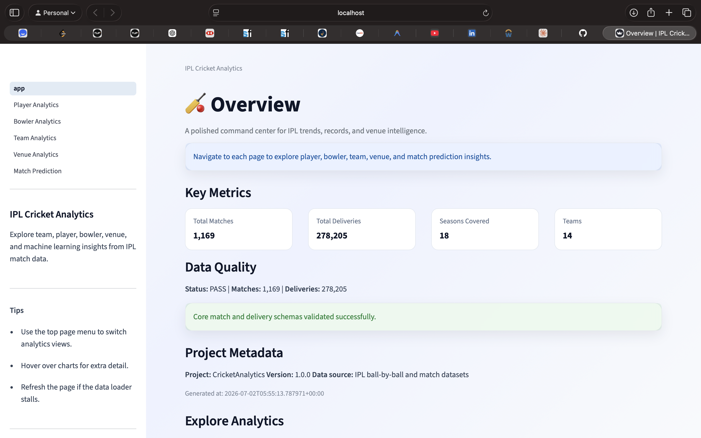
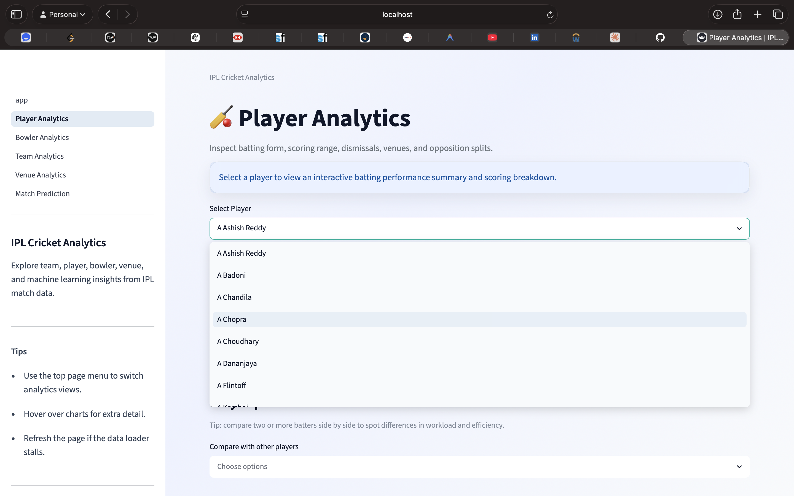

# 🏏 IPL Cricket Analytics Dashboard

[](https://www.python.org/)
[](https://streamlit.io/)
[](https://opensource.org/licenses/MIT)

A polished, end-to-end IPL analytics project that turns raw cricket data into an interactive dashboard for exploring player, team, venue, and match-prediction insights. It combines data engineering, analytics, visualization, and machine learning in a single Streamlit experience.

## 🎯 Why this project stands out

This project demonstrates a complete data-product workflow:
- ingesting and validating raw IPL datasets
- building reusable analytics functions
- creating interactive dashboards with Streamlit and Plotly
- training and serving a lightweight prediction model
- packaging the project so it can be run locally or in a container

## 🚀 What you can explore

- Player performance trends, milestones, and opposition splits
- Bowler economy, wickets, and venue-specific performance
- Team win trends, top contributors, and head-to-head insights
- Venue-based scoring and toss-impact analysis
- Match outcome prediction using historical match context

## 🧭 How it works

```text
Raw IPL CSV files
  -> Data validation and standardization
  -> Analytics functions and reusable services
  -> Streamlit dashboard with interactive charts
  -> ML-based match prediction workflow
```

## ✨ Key features

### 🏏 Player Analytics
- career-level batting summaries
- runs by season, venue, and opposition
- key milestones such as high scores and batting consistency

### 🎯 Bowler Analytics
- wickets, averages, economy, and bowling figures
- venue-based bowling performance
- season-wise progression and bowling milestones

### 🏆 Team Analytics
- team win percentages and seasonal trends
- top batters and wicket-takers by team
- head-to-head comparisons

### 🏟️ Venue Analytics
- venue-wise match and scoring patterns
- team performance at specific grounds
- toss and venue impact insights

### 🤖 Match Prediction
- historical match metadata-based winner prediction
- reusable trained model with saved weights
- user-driven inputs for teams, venue, toss, and year

## 📊 Dashboard pages

| Page | Purpose |
|------|---------|
| Overview | High-level project summary and dashboard highlights |
| Player Analytics | Batting performance and player insights |
| Bowler Analytics | Bowling metrics and performance breakdowns |
| Team Analytics | Team records, trends, and top contributors |
| Venue Analytics | Venue-based scoring and historical patterns |
| Match Prediction | ML-powered match outcome estimation |

## 🚀 Quick start

### Prerequisites
- Python 3.10+
- pip

### Installation

```bash
git clone https://github.com/yourusername/CricketAnalytics.git
cd CricketAnalytics
python3 -m venv .venv
source .venv/bin/activate
make install
```

### Run locally

```bash
make run
```

Open the URL shown in the terminal.

### Run on a custom port

```bash
PORT=8502 make run
```

If port 8501 is in use, specify a different port like `8502`.

### Useful commands

```bash
make test
make smoke
./scripts/run_dashboard.sh
./scripts/smoke_test.sh
```

## 📁 Project structure

```text
CricketAnalytics/
├── dashboard/
│   ├── app.py
│   └── pages/
├── src/
│   ├── analytics/
│   ├── services/
│   ├── utils/
│   └── visualizations/
├── data/
│   ├── raw/
│   └── processed/
├── models/
├── notebooks/
├── tests/
├── requirements.txt
├── pyproject.toml
├── Makefile
└── README.md
```

## 🛠️ Tech stack

| Technology | Purpose |
|-----------|---------|
| Python | Core application logic |
| Streamlit | Interactive dashboard UI |
| Pandas | Data processing |
| NumPy | Numerical operations |
| Plotly | Interactive visualizations |
| Matplotlib | Static charting |
| scikit-learn | Prediction model |
| joblib | Model serialization |

## 📊 Dataset overview

Source: IPL ball-by-ball and match datasets covering the IPL era.

Coverage includes:
- 1,169+ matches
- 278,000+ deliveries
- 18 seasons
- 14 teams

## ✅ Validation and quality

The project includes:
- automated tests with pytest
- data-quality checks for core match and delivery schemas
- a lightweight smoke test for analytics outputs

## � Portfolio screenshot 




## 🚀 Deploying the app

To publish the app publicly, consider one of these options:
- Streamlit Cloud for a free hosted demo
- Docker for reproducible deployment
- GitHub Pages for static project documentation, while keeping the dashboard on Streamlit

## �📈 Future improvements

- player-vs-player comparison experience
- richer prediction features and evaluation metrics
- deployment to Streamlit Cloud or Docker Hub
- screenshot-based portfolio showcase
- [ ] Advanced filtering options
- [ ] Export functionality (PDF, CSV)
- [ ] Real-time data updates
- [ ] Player injury impact analysis
- [ ] Advanced statistics (runs per over, dot ball percentage)
- [ ] Trend analysis and forecasting

## 🤝 Contributing

Contributions are welcome! Please feel free to submit a Pull Request or open an issue for bugs and feature requests.

## 📝 License

This project is open source and available under the MIT License.

## 👤 Author

Shreyas TK

## 📞 Support

For questions or issues, please open an issue on GitHub or contact the project maintainer.

---

**Last Updated:** 2025 IPL Season | Data Coverage: 2008-2025